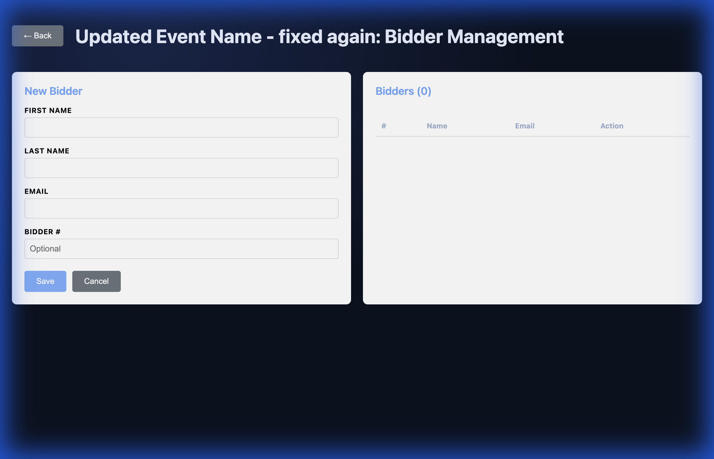
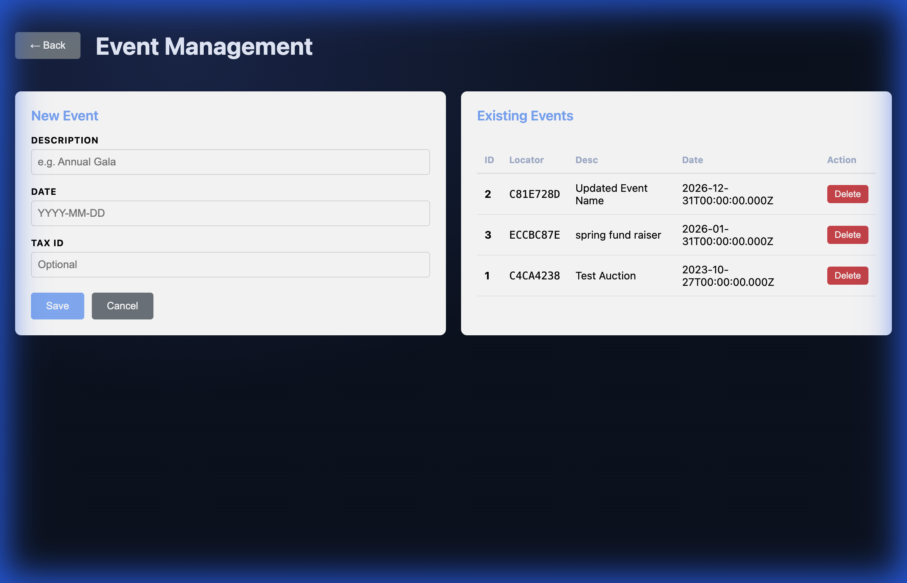
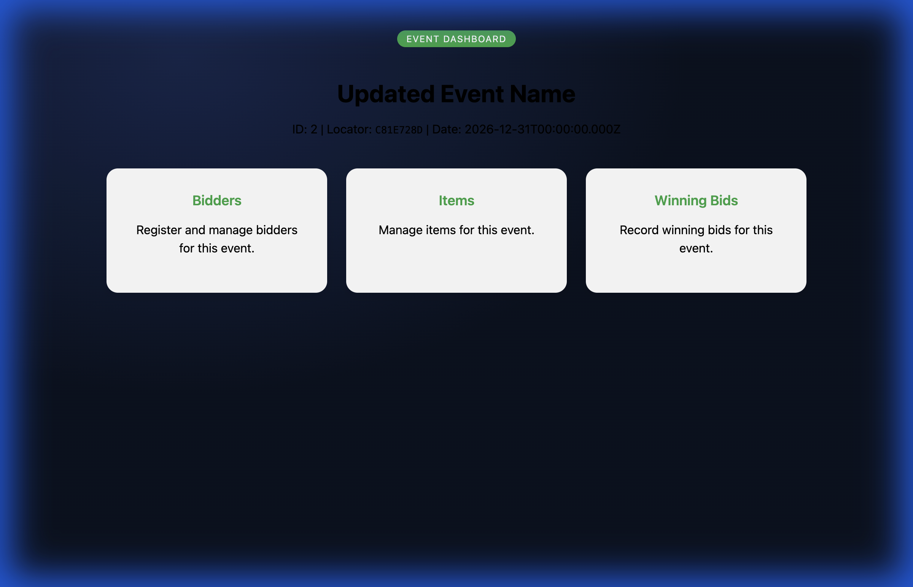
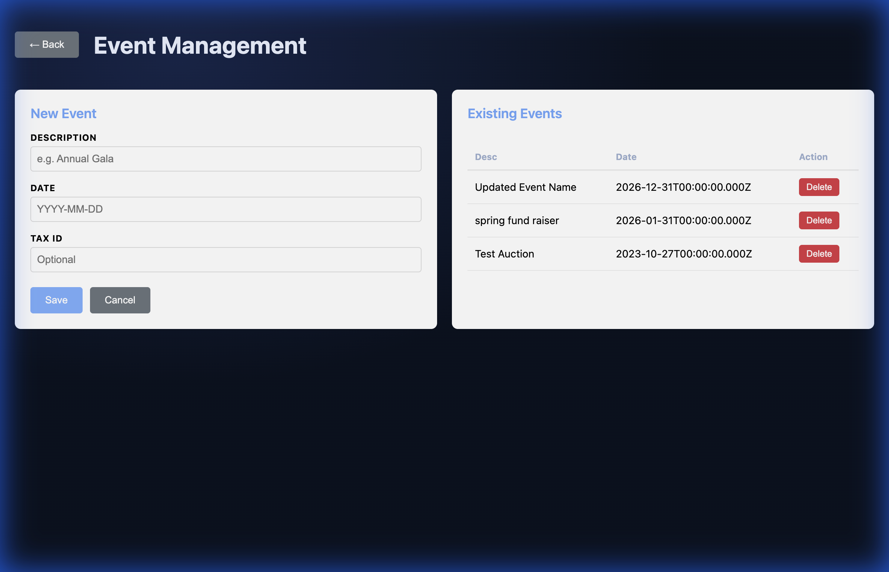

# Security & Feature Implementation Walkthrough

High-level summary of security improvements, core feature enhancements, and readability fixes.

## 1. Security Hardening
Implemented critical security measures in the Nginx configuration:
- **Security Headers**: Added CSP, X-Frame-Options, X-Content-Type-Options, and Referrer-Policy.
- **Privacy**: Disabled Nginx version reporting (`server_tokens off`).

## 2. Dashboard Access & Layout Fixes
Resolved the issue where the User Dashboard displayed admin navigation and "Not Found" errors:
- **Role Separation**: Distinct `AdminDashboardComponent` and `UserDashboardComponent`.
- **Event Resolution**: Enhanced backend to prioritize MD5-hash `event_locator` lookups.
- **Locator Routing**: Refactored user-facing URLs to use `event_locator` instead of `event_id` in query parameters. This makes event URLs harder to guess and improves overall security.
- **Bug Fix**: Resolved the `400 Bad Request` error when updating events by sanitizing the ISO date format to `YYYY-MM-DD` on the frontend.

## 3. Full CRUD Implementation
Enabled full Create, Read, Update, and Delete operations for Events, Bidders, Items, and Winning Bids:
- **Backend**: Added `PUT` routes and update logic to [app.js](../../backend/src/app.js).
- **Frontend**: Updated all form components to support editing existing records and locator-based initialization.

## 4. Readability Improvements
Darkened text across the application to ensure excellent contrast on white backgrounds:
- **Headers & Paragraphs**: Changed all card descriptions and dashboard headers to black.
- **Form Labels**: Forced all form labels to use black text for clarity.
- **Inputs & Selects**: Explicitly set input text to black and backgrounds to white.

## Verification Gallery

````carousel

<!-- slide -->

<!-- slide -->

<!-- slide -->

<!-- slide -->

````

## Final Status
Verified backend connectivity via `curl` and frontend rendering via browser tools. The application is now secure, compliant with the original specification, and significantly more readable.
